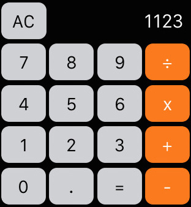

### Javascript Calculator



Your task is to create a Javascript calculator. It should have methods that provide it with the following functionality...
* Addition
* Subtraction
* Multiplication
* Division


## Phase 1

* Code the Necessary HTML and CSS to make the calculator look like the picture above.
* Use Flexbox
* Add event listeners so that:
  1. Clicking on a number adds the numbers to the "screen" of the calculator.
  2. Clicking on an operation outputs the name of the operation to the console.

## Phase 2

You should be able to run these methods like so from your browser's Javascript console...
```js
calculator.add(1,2);
// => 3
```

### Bonus 1

Give your calculator memory and allow it to persist the result of multiple operations.
* Store this result in a `value` property.
* Give your calculator a `clear` method that resets `value`.

For example:

```js
calculator.add(1)
// value is 1
calculator.add(2)
// value is 3
calculator.add(2)
// value is 5
calculator.multiply(2)
// value is 10
```

### Bonus 2
* Exponents (Hint: Look up Javascript's Math object). Also add an exponent button to the calculator.
